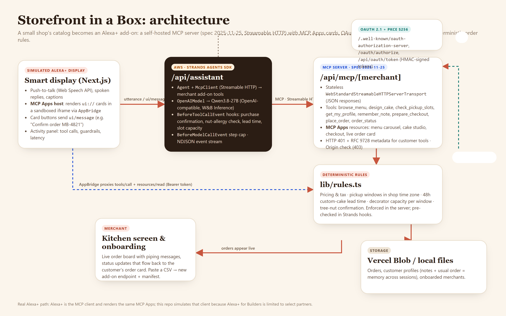

# Storefront in a Box

**The bakery on the corner deserves voice ordering too.** Storefront in a Box turns a small shop's catalog into an **Alexa+ add-on**: a self-hosted MCP server (spec 2025-11-25, Streamable HTTP) with interactive MCP Apps cards (menu carousel, custom-cake studio, checkout, live order status), OAuth 2.1 + PKCE account linking, customer memory, and deterministic order rules. A **Strands Agents SDK** assistant plays the role of Alexa+ on a simulated smart display, and orders land on the shop's kitchen screen.

- **Live demo:** LIVE_URL (display: `/device` · kitchen screen: `/merchant/marigold` · onboarding: `/onboard` · pitch: `/slides.html`)
- **Demo video:** VIDEO_URL
- **Track:** Alexa+ · **Mini challenge:** AWS Builder (Strands Agents SDK)

New work built during the hackathon window (from Aug 31, 2026). All shops, customers and payments in this repo are fictional or simulated.



## The problem

Voice and agentic commerce is arriving, and independent shops are being left out.

- The U.S. has **36.2 million small businesses**, which account for **almost 46% of private-sector employment** ([SBA Office of Advocacy, 2025](https://advocacy.sba.gov/2025/06/30/new-advocacy-report-shows-the-number-of-small-businesses-in-the-u-s-exceeds-36-million/)).
- To reach customers through a big platform today, a bakery typically joins a delivery marketplace that takes **15%, 25% or 30% commission on delivery orders** (DoorDash Basic / Plus / Premier, [DoorDash merchant pricing](https://merchants.doordash.com/en-us/pricing)).
- Building for Alexa+ is **"currently available to select partners working directly with our team"**; the names on the page are OpenTable, Thumbtack and Atom Tickets ([Amazon, Alexa+ for Builders](https://developer.amazon.com/en-US/alexa/alexa-ai)). The owner of a six-person bakery isn't going to write an MCP server with OAuth, MCP Apps and capacity rules.

**Who it's for:** owner-operated bakeries, cafés and florists, and the regulars who'd rather say "my usual for Saturday" than install another app.

## Our solution

1. **Onboard in minutes** (`/onboard`): paste a catalog CSV. The shop gets its own MCP endpoint `/api/mcp/<shop>`, account-linking metadata and an add-on manifest.
2. **Customers order by voice** on an Alexa+-style display (`/device`):
   - "What cakes do you have?" shows a **menu carousel card**.
   - "Customize" opens the **cake studio card** (flavor, size, frosting, message piped on top).
   - The add-on checks **real pickup capacity**: 48 hours' notice for custom cakes and two decorator slots per window.
   - Items with tree nuts require a **nut-allergy check**, and the answer is **remembered** for next time.
   - The **checkout card** shows a code; nothing is charged until the customer taps **Pay**.
3. **The shop sees it instantly** (`/merchant/marigold`): the order appears on the kitchen screen with the message to pipe, and status changes ("In the oven", "Ready") flow back to the customer's live order card.
4. **Memory across sessions:** next week, "my usual for Sunday" works, and the agent already knows Leo is allergic to tree nuts.

**What stays human:** the customer confirms every purchase on screen, answers the allergy question, and the shop decides when an order is baking or ready.

## How we use Amazon's tech

### Alexa+ (MCP add-on)

Alexa+ integrations are MCP servers. Builder access is limited to select partners, so we built exactly what the MCP Toolkit asks for and **simulated the Alexa+ client** (allowed by the hackathon rules).

| Alexa+ / MCP requirement | Where |
| --- | --- |
| MCP spec **2025-11-25** over **Streamable HTTP** (stateless, JSON responses; verified `protocolVersion: "2025-11-25"` on `initialize`) | `app/api/mcp/[merchant]/route.ts` (`WebStandardStreamableHTTPServerTransport`) |
| 8 tools with annotations and structured output: `browse_menu`, `design_cake`, `check_pickup_slots`, `get_my_profile`, `remember_note`, `prepare_checkout`, `place_order`, `order_status` | `lib/mcp-server.ts` |
| **MCP Apps** visuals: `ui://storefront/menu.html`, `cake-studio.html`, `checkout.html`, `order.html` (`text/html;profile=mcp-app`, `_meta.ui.resourceUri`). Cards send `ui/message` (add to order, **Pay**) and call `order_status` through the host to update live | `lib/views.ts`, `lib/tool-ui.ts` |
| **Account linking**: OAuth 2.1 authorization code + **PKCE S256**, RFC 8414 metadata (`code_challenge_methods_supported: ["S256"]`), RFC 9728 protected-resource metadata, HTTP **401** with `WWW-Authenticate` for customer tools | `app/.well-known/*`, `app/oauth/authorize`, `app/api/oauth/*`, `lib/auth.ts` |
| Origin validation (403), per-IP rate limits, fast tool round trips (typically 30–70 ms, shown in the display's activity panel; Alexa+ asks for < 500 ms) | `app/api/mcp/[merchant]/route.ts`, `lib/ratelimit.ts` |
| **Agent Skill** describing how an agent should use the add-on | `skills/storefront-in-a-box/SKILL.md` |
| Simulated Alexa+ client: MCP Apps host (`AppBridge` + sandboxed iframe), push-to-talk (Web Speech API), spoken replies, captions | `components/Device.tsx`, `components/AppFrame.tsx` |

### AWS: Strands Agents SDK (AWS Builder mini challenge)

The display's brain is a **Strands Agents SDK (TypeScript)** agent in `app/api/assistant/route.ts`:

- `Agent` with **Strands `McpClient`** connected to the shop's add-on over Streamable HTTP, carrying the linked account's Bearer token, so it uses the add-on exactly like Alexa+ would.
- `OpenAIModel` pointed at an OpenAI-compatible endpoint (Qwen3.8-27B on W&B Inference, temperature 0). Strands is model-agnostic, so Amazon Bedrock is a one-line provider swap. We didn't use Bedrock, to stay on free services.
- **Hooks as guardrails, in code, not prompts:**
  - `BeforeToolCallEvent` blocks `place_order` unless the customer's own message carries the checkout code (the Pay tap).
  - It blocks `prepare_checkout` if tree nuts are in the cart without a customer-answered allergy question, or if lead time or decorator capacity would be violated.
  - `BeforeModelCallEvent` caps steps.
  - `AfterToolCallEvent` and `ModelMessageEvent` stream every tool call, hook decision, latency and reply to the UI as NDJSON.
- The same rules (`lib/rules.ts`) are enforced again inside the MCP server, so a different client (real Alexa+) gets identical behavior.
- A new session recalls the customer (`get_my_profile`) deterministically before the model speaks.

Not deployed to AgentCore; everything runs as a Next.js app on Vercel. Persistence uses Vercel Blob when `BLOB_READ_WRITE_TOKEN` is set, otherwise local files.

## Try it

1. Open **LIVE_URL/device** and click **Link account** → **Allow** (demo authorization server; any name works).
2. Type or say: "Hi! My son Leo turns 7 on Saturday. What cakes do you have?"
3. Tap **Customize**, pick a size, frosting and message, then **Add to order**.
4. Say: "Noon works. Also add two almond croissants." The assistant asks about nut allergies.
5. Say: "Oh no, Leo's allergic to tree nuts. Skip the croissants, add morning buns instead." The checkout card appears.
6. Tap **Pay**, then open **Kitchen screen ↗** and press **Start baking**; the order card updates within a few seconds.
7. Click **New session** and ask: "Can I get my usual for Sunday morning?"

Point any MCP client (MCP Inspector, Claude, VS Code, Goose) at `LIVE_URL/api/mcp/marigold`. Browsing works without auth; customer tools trigger OAuth.

```bash
npx @modelcontextprotocol/inspector --cli LIVE_URL/api/mcp/marigold --transport http --method tools/list
```

## Run locally

Requires Node 20+ and pnpm.

```bash
pnpm install
cp .env.example .env.local     # set OPENAI_API_KEY (any OpenAI-compatible endpoint) and AUTH_SECRET
pnpm dev                        # http://localhost:3000/device
```

`pnpm vendor` regenerates `lib/vendor/ext-apps-bundle.ts` from `@modelcontextprotocol/ext-apps` (the View SDK is inlined so cards work in a sandboxed iframe with no network).

## Project layout

```
app/api/mcp/[merchant]/route.ts   MCP server endpoint (Streamable HTTP, auth, origin check)
app/api/assistant/route.ts        Strands Agents SDK assistant + guardrail hooks (NDJSON stream)
app/.well-known/…, app/oauth, app/api/oauth   OAuth 2.1 + PKCE account linking
lib/mcp-server.ts                 tools + MCP Apps resources
lib/views.ts                      MCP Apps card HTML (menu, cake studio, checkout, order status)
lib/rules.ts                      pricing, pickup windows, lead time, capacity, allergen rules
lib/store.ts                      orders, customer profiles, merchants (Vercel Blob or files)
components/Device.tsx, AppFrame.tsx   simulated Alexa+ display + MCP Apps host
components/Kitchen.tsx, Onboard.tsx   merchant kitchen screen and onboarding
skills/storefront-in-a-box/SKILL.md   Agent Skill
FRICTION_LOG.md                   developer-experience friction we hit
```

## Built with

Next.js 16 · TypeScript · Strands Agents SDK (TypeScript) · Model Context Protocol TypeScript SDK · MCP Apps (`@modelcontextprotocol/ext-apps`) · Zod · Tailwind CSS · Vercel (+ Blob) · Qwen3.8-27B via W&B Inference (OpenAI-compatible). Claude Code was used as a coding assistant. Demo video narration by ElevenLabs. Third-party assets: `docs/CREDITS.md`.

## License

TBD before submission.
